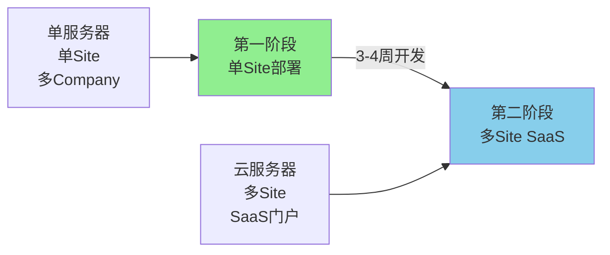
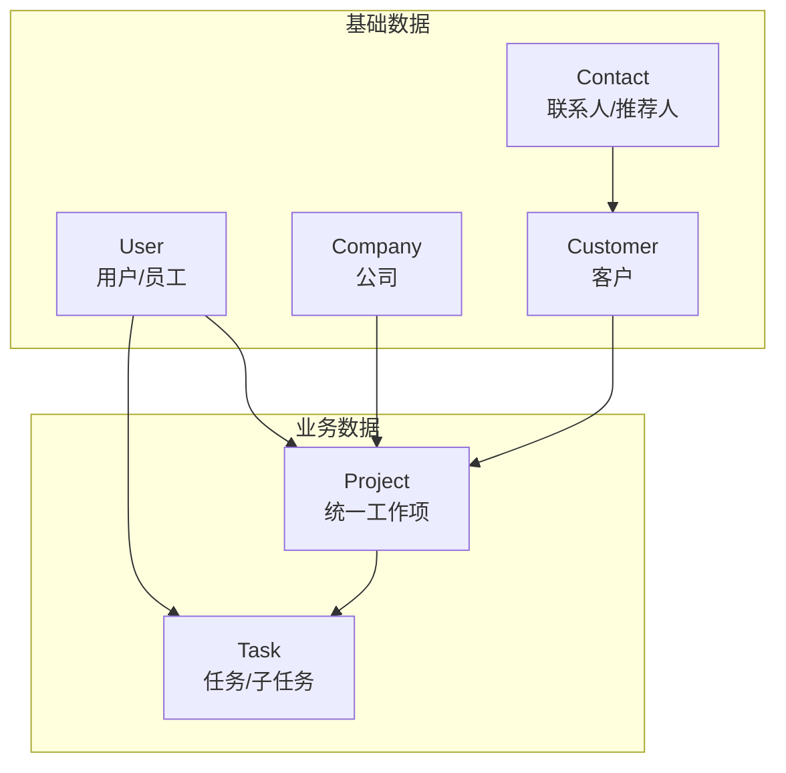
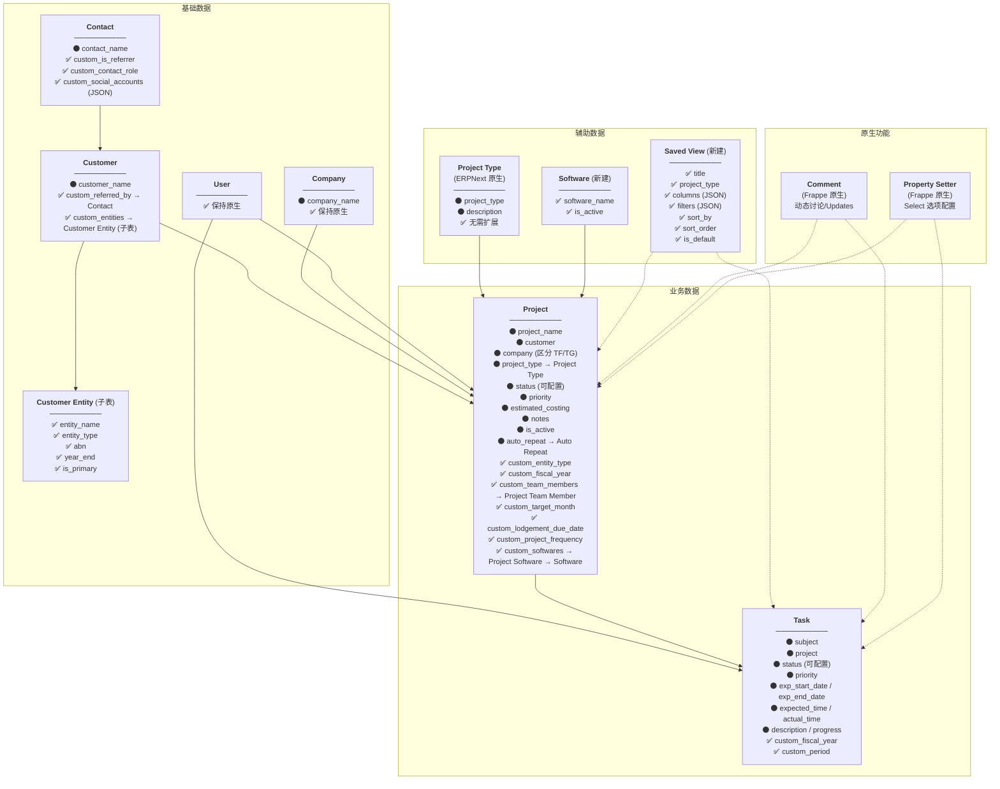
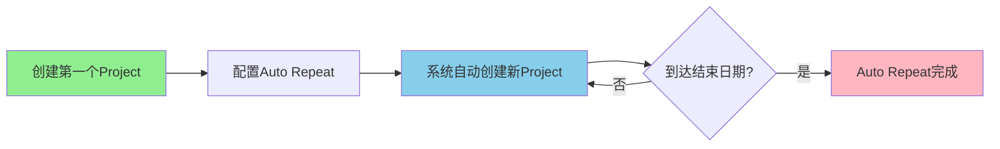

# 📄 Document A: Data Model - Refactoring Plan
# 数据模型 - 重构规划文档

**项目**: Smart Accounting  
**版本**: v8.4  
**日期**: 2026-03-10  
**状态**: ✅ 已落地（持续迭代）  
**重构策略**: ✅ **最大化利用 ERPNext 原生 DocType + Smart Board 配置化模型**  
**SaaS架构**: ✅ **Frappe原生多Site架构**（两阶段演进，无需tenant_id）

---

## 2026-04 当前状态补充

### 近期已落地的数据模型相关变化

- ✅ **Smart Grants 已进入实际使用与导入阶段**
  - 当前项目结构已不仅是设计验证，Smart Grants 数据已开始导入并成功进入系统使用流程。
- ✅ **Client → Project 的 Partner 自动承接已落地**
  - 创建 Client 时可记录 Partner，后续基于该 Client 创建的 Project 会自动带出对应 Partner。
- ✅ **New Project 的 Fiscal Year / Frequency 自动预填已落地**
  - 创建 Project 时的默认值逻辑已经进入实际使用，减少重复输入。
- ✅ **Smart Grants 缺失字段已补齐**
  - Project / Smart Grants board 已补回缺失的三列字段，并进入当前使用结构。
- ✅ **Users 管理能力已增强**
  - Admin-only 的用户新增、移除、状态查看与访问管理已进入当前产品能力范围。

### 文档使用建议

- 本文档继续作为**数据结构与字段设计参考**保留。
- 每周新增的实施、验证、导入、核对记录，不再直接堆到本文件，统一进入：
  - `../project-docs/r-and-d-notes/`

## 更新日志 (v8.4 - 2026-03-10)

### 🎯 当前实现对齐（文档校正）
- ✅ **Dashboard / Client-scoped 视图落地**：产品入口已不只是 board，当前稳定包含 `dashboard`、`client-projects`、`status-projects`、`archived-clients`、`automation-logs`、`settings`、`report`
- ✅ **Project 实体字段补齐**：当前数据模型已包含 `custom_customer_entity`（Link -> Customer Entity）、`custom_year_end`，其中 `custom_entity_type` 更偏向展示/派生字段
- ✅ **Archive 元数据落地**：除 `is_active` 外，当前还使用 `custom_archive_source` / `custom_archive_source_ref` 跟踪归档来源
- ✅ **Saved View v2**：当前实现已使用 `reference_doctype`、`is_active`、`scope`、`sidebar_order` 等字段，不再是“仅 7 字段”的极简版本
- ✅ **状态配置口径调整**：Project 状态采用“Property Setter 全局池 + board-level allowed subset”模式，board 子集由 Board Settings API 管理
- ✅ **说明**：文档中早期关于 Auto Repeat 的章节保留为历史设计背景，但**不再作为当前 Smart Board 的权威实现说明**

## 更新日志 (v8.3 - 2026-01-19)

### 🎯 Smart Board 数据结构对齐（落地）
- ✅ **Task 成员字段统一**：Task 使用 `custom_task_members`（Table → `Project Team Member`），与 Project 成员结构一致（便于人员 cell 复用与头像渲染）
- ✅ **Monthly Status 落地**：引入通用 DocType `Monthly Status`，用于 Task 的 12 个月网格状态 + Project 的月度汇总
- ✅ **Engagement Letter 落地**：Project 使用 `custom_engagement_letter`（Attach），Smart Board 支持上传/Replace/查看

## 更新日志 (v8.2 - 2025-12-18)

### 🎯 团队字段架构优化（Critical - 提升SaaS可扩展性）
- ✅ **custom_team从JSON改为子表**：提升查询性能和数据完整性
- ✅ **创建Project Team Member子表**：3个字段（user, role, assigned_date）
- ✅ **Project扩展字段优化**：移除 `custom_team`（JSON），`custom_team_members` 改为 Table；并支持 `custom_engagement_letter`（Attach）
- ✅ **查询性能提升**：支持数据库级别索引和JOIN，高效查询"用户的所有Projects"
- ✅ **SaaS可扩展性**：大规模数据（>10000 Projects）性能稳定
- ✅ **数据完整性**：外键约束，用户删除时可级联清理
- ✅ **报表友好**：直接SQL聚合统计，无需应用层解析JSON

### 更新影响范围
- ✅ Auto Repeat继承逻辑更新：从JSON复制改为子表append
- ✅ 架构图更新：custom_team (JSON)改为custom_team_members → Project Team Member
- ✅ 实施步骤更新：Step 3新增创建Project Team Member子表

---

## 更新日志 (v8.1 - 2025-12-17)

### 🎯 客户多实体支持（Critical）
- ✅ **Customer Entity子表**：支持一个客户拥有多个实体（Individual/Company/Trust等）
- ✅ **Project关联实体**：添加custom_entity_type字段，明确每个Project对应哪个实体
- ✅ **避免数据冗余**：不需要为同一客户的不同实体创建多个Customer记录
- ✅ **实施简单**：仅需1个子表DocType + 2个字段修改

### 🔧 Auto Repeat自动创建机制
- ✅ **UI选择frequency**：用户创建Project时选择custom_project_frequency（Monthly/Quarterly/Yearly）
- ✅ **自动创建Auto Repeat**：Project保存后自动创建对应的Auto Repeat记录
- ✅ **双向同步**：修改custom_project_frequency时自动更新Auto Repeat.frequency
- ✅ **开发成本**：约2-3小时（after_insert和validate钩子）

### 🎯 周期性业务架构优化（v8.0）
- ✅ **采用Frappe原生Auto Repeat**：自动创建周期性Project，完全利用原生功能
- ✅ **每个周期独立Project**：每个月/季度是独立的Project，不是Task（层级清晰）
- ✅ **符合Monday.com风格**：每行都是独立工作项，不是容器+子任务的混乱层级
- ✅ **Task回归本来用途**：仅作为Project的执行步骤（可选），扩展字段保持2个
- ✅ **自动命名和归档**：通过on_recurring钩子自动生成新Project名称

### SaaS架构演进策略（v7.1）
- ✅ **两阶段演进路径**：第一阶段单Site部署（当前），第二阶段多Site SaaS（未来）
- ✅ **完全利用原生机制**：不需要添加tenant_id字段，Site本身就是租户隔离单元
- ✅ **零额外成本**：第一阶段完全利用原生功能，无额外开发
- ✅ **平滑升级**：第二阶段仅需3-4周（主要是SaaS门户），核心代码无需修改
- ✅ **架构优势**：物理隔离 > 逻辑隔离，Site方案比传统tenant_id方案更安全、更简单

### 架构优化（v7.0）
- ✅ **Software DocType**：极简设计，仅2个字段（software_name, is_active）
- ✅ **Project Type**：使用ERPNext原生，无需扩展字段
- ✅ **Saved View**：精简到7个核心字段（删除company等冗余字段）
- ✅ **Project扩展**：7个字段（含fiscal_year）
- ✅ **数据隔离**：Company字段区分TF/TG，User Permissions控制访问范围

---

## 目录

1. [重构决策（已确认）](#1-重构决策已确认)
2. [新架构概览](#2-新架构概览)
3. [核心 DocType 字段设计](#3-核心-doctype-字段设计)
4. [辅助 DocType](#4-辅助-doctype)
5. [删除的 DocType](#5-删除的-doctype)
6. [使用场景](#6-使用场景)
7. [实施步骤](#7-实施步骤)
8. [待确认问题](#8-待确认问题)

---

## 1. 重构决策（已确认）

### 1.1 重构策略

| 决策项 | 结果 | 日期 |
|--------|------|------|
| **核心原则** | ✅ 最大化利用 ERPNext 原生 DocType | 2025-12-10 |
| **Project** | ✅ 使用 ERPNext 原生 Project + 扩展字段（统一承载所有业务类型）| 2025-12-10 |
| **Task** | ✅ 使用 ERPNext 原生 Task + 扩展字段 | 2025-12-10 |
| **Engagement** | ❌ **不再新建**，用 Project 替代 | 2025-12-10 |
| **Saved View** | ✅ 新建 DocType，替代 Partition | 2025-12-10 |

### 1.2 为什么只用 Project？

| 考量 | 说明 |
|------|------|
| **简化架构** | 一个 DocType 统一承载会计业务和项目业务 |
| **减少开发量** | Project 是 ERPNext 原生，只需扩展字段 |
| **SaaS 友好** | 不同客户（会计所/项目公司）用同一个 Project，通过 `project_type` 区分 |
| **维护简单** | 一套代码，更容易维护 |

### 1.3 架构处理方式

| 层级 | 处理方式 |
|------|---------|
| **ERPNext 原生扩展** | Customer / Contact / Project / Task 保持原生，添加扩展字段 |
| **ERPNext 原生直接使用** | User / Company / Project Type 保持原生，无需扩展 |
| **新建 DocType** | Customer Entity（子表5字段）、Project Team Member（子表3字段）、Software（极简2字段）、Saved View（v2 视图配置）、Monthly Status（通用状态表）、Board Automation、Automation Run Log、Automation Run Log Change |
| **Property Setter** | Project.status 等全局 Select 选项配置（多Site架构下每租户独立配置）|
| **Board 级配置** | Board Settings / Status Settings 负责 Project Type 顺序、board allowed statuses 等产品层配置 |
| **原生功能利用** | Comment 系统、User Settings、Attach 上传、Frappe Website 平台壳（`/smart` selector + `/smart-accounting` 模块入口） |
| **Auto Repeat** | `custom_project_frequency` 字段仍保留，但 Auto Repeat 不再作为当前 Smart Board 文档的主实现路径 |
| **现有数据** | 编写迁移脚本从旧 Task 结构转移到 Project |

### 1.4 SaaS架构演进策略 ✅ **完全利用Frappe原生Site机制**

> **核心原则**：不需要添加任何 `tenant_id` 字段，Frappe 的 Site 本身就是租户隔离单元

#### 第一阶段（当前）：单租户部署

```
物理架构：单物理服务器 + 单 Site
数据隔离：Company 字段区分 TF/TG
权限控制：User Permissions 限制用户访问范围

Site: your-company.yoursite.com (单租户)
  ├── Company: TF (会计事务所)
  │   ├── Project (ITR/BAS/Bookkeeping...)
  │   ├── Customer
  │   └── Task
  │
  └── Company: TG (R&D 业务)
      ├── Project (R&D Grant...)
      ├── Customer
      └── Task
```

**利用的原生资源：**
- ✅ **Site**：单租户环境
- ✅ **Company**：TF/TG 数据隔离（ERPNext 原生）
- ✅ **User Permissions**：限制用户只看特定 Company（Frappe 原生）
- ✅ **Project/Task/Customer**：ERPNext 原生 + 扩展字段

**开发成本：** ✅ 零额外成本（完全利用原生功能）

#### 第二阶段（未来）：多租户 SaaS

```
物理架构：云服务器 + 多 Site（每租户独立 Site）
租户隔离：Site 级别（独立数据库，完全物理隔离）
扩展能力：Frappe Bench 原生支持管理数百个 Site

SaaS 服务器（云端）
├── Site 1: firm-a.accounting.com (租户A - 会计所A)
│   ├── Company: Main Office
│   └── Company: Branch Office
│
├── Site 2: firm-b.accounting.com (租户B - 会计所B)
│   └── Company: Firm B
│
└── Site 3: firm-c.accounting.com (租户C - 会计所C)
    └── Company: Firm C
```

**改造工作量评估：**

| 工作项 | 工作量 | 说明 |
|-------|-------|------|
| **Site 创建自动化** | 🟢 低（1周） | 脚本自动创建新 Site |
| **SaaS 门户开发** | 🔴 高（2-3周） | 注册、计费、Site 管理界面 |
| **数据迁移** | ✅ 不需要 | 新租户使用新 Site，无迁移 |
| **核心代码修改** | ✅ 不需要 | App 代码完全不变 |
| **权限系统改造** | ✅ 不需要 | Site 天然隔离 |
| **配置隔离** | ✅ 不需要 | 每个 Site 独立配置 |

**预估改造时间：** 3-4 周（主要是 SaaS 门户开发）

#### 为什么不需要 tenant_id 字段？

```python
# ❌ 传统 SaaS 架构（共享数据库）
Project:
  - tenant_id         # 需要手动添加
  - company
  - customer
  
WHERE tenant_id = ? AND company = ?  # 每个查询都要过滤

# ✅ Frappe Site 架构（Site 隔离）
Project:
  - company           # 只需要 Company 字段
  - customer
  
# 每个 Site 有独立数据库，Site 本身就是租户边界
# 查询自动限定在当前 Site 的数据库中
```

**优势对比：**

| 特性 | 传统 tenant_id 方案 | Frappe Site 方案 |
|-----|-------------------|-----------------|
| **数据隔离** | 逻辑隔离（同一数据库） | 物理隔离（独立数据库） |
| **安全性** | 中等（依赖代码正确性） | 高（数据库级别隔离） |
| **第一阶段开发成本** | 需要添加字段和过滤逻辑 | ✅ 零成本 |
| **第二阶段改造成本** | 2-3个月（数据迁移+代码） | 3-4周（仅 SaaS 门户） |
| **租户配置独立性** | 需要额外设计 | ✅ 天然独立 |
| **性能** | 需要索引优化 | ✅ 租户间完全独立 |

#### 架构演进路径



---

## 2. 新架构概览

### 2.1 核心设计理念

```
统一工作项 + 用户自定义视图：

- Project    → 统一承载所有业务（会计业务 / Grants项目 / 其他）
- Task       → 子任务 或 独立任务
- Saved View → 替代 Partition，用户自定义显示字段

通过 project_type 区分业务类型：
- "ITR" / "BAS" / "Bookkeeping" → 会计业务
- "R&D Grant" / "Export Grant" → Grants 项目
- 其他自定义类型...
```

### 2.2 新架构关系图 (Mermaid)

**图 1：核心架构概览**



---

**图 2：完整 DocType 架构（开发参考）**

> **图例**：⚫ 原生字段 | ✅ 已确认扩展 | 🔧 可配置（Property Setter）



### 2.3 统一 Workflow 链

```
┌─────────────────────────────────────────────────────────────────┐
│                    统一业务链（Project 承载所有业务）              │
├─────────────────────────────────────────────────────────────────┤
│                                                                  │
│   Company ──┐                                                    │
│             ├──► Project ──► Task                               │
│   Customer ─┘      │                                            │
│                    │                                            │
│                    ├── project_type = "ITR" (会计业务)          │
│                    ├── project_type = "BAS" (会计业务)          │
│                    ├── project_type = "Bookkeeping" (会计业务)  │
│                    ├── project_type = "R&D Grant" (Grants)      │
│                    └── project_type = "..." (其他)              │
│                                                                  │
│   示例 1: TF + Client A → FY24 ITR (type=ITR) → Collect Docs   │
│   示例 2: TG + Client B → R&D Grant 2024 (type=R&D) → Submit   │
│                                                                  │
└─────────────────────────────────────────────────────────────────┘
```

### 2.4 开发顺序

> **从干净原生 ERPNext 开始，逐步扩展：**

```
Step 1: 创建子表DocType
        └── Customer Entity 子表（5个字段：entity_name, entity_type, abn, year_end, is_primary）

Step 2: 基础层扩展
        ├── Customer 扩展（2个字段：custom_referred_by, custom_entities → Customer Entity）
        └── Contact 扩展（3个字段：custom_is_referrer, custom_contact_role, custom_social_accounts）

Step 3: 核心层扩展
        ├── 创建 Project Team Member 子表（3个字段：user, role, assigned_date）
        ├── Project 扩展（8个扩展字段：custom_entity_type, custom_team_members, custom_fiscal_year, custom_target_month, custom_lodgement_due_date, custom_project_frequency, custom_softwares, custom_engagement_letter）
        ├── Task 扩展（2个扩展字段：custom_fiscal_year, custom_period）+ Task 成员子表（custom_task_members → Project Team Member）
        ├── Monthly Status DocType（用于 12 个月状态网格/汇总）
        └── Project Auto Repeat 钩子（after_insert/validate方法：自动创建和同步Auto Repeat）

Step 4: 视图层
        ├── 创建 Software DocType（2个字段）
        └── 创建 Saved View DocType（7个字段）

Step 5: 数据迁移
        └── 旧 Task 数据 → Project
```

---

## 3. 核心 DocType 字段设计

### 3.1 Project（统一工作项）

> **定位**：使用 ERPNext 原生 Project，添加扩展字段，统一承载所有业务类型（会计业务 + Grants 项目 + 其他）

| 字段 | 字段名 | 类型 | 必填 | 来源 | 说明 |
|------|--------|------|------|------|------|
| **原生字段（直接使用）** ||||||
| 项目名称 | `project_name` | Data | ✅ | ERPNext 原生 | 如 "Client A - FY24 ITR" |
| 客户 | `customer` | Link → Customer | ✅ | ERPNext 原生 | 所属客户 |
| 公司 | `company` | Link → Company | ✅ | ERPNext 原生 | 所属公司（区分 TF/TG，用于筛选和权限控制）|
| 状态 | `status` | Select | ✅ | ERPNext 原生 | 工作状态（可通过 Property Setter 配置选项）|
| 优先级 | `priority` | Select | | ERPNext 原生 | Low/Medium/High |
| 预计开始 | `expected_start_date` | Date | | ERPNext 原生 | 开始日期 |
| 预计结束 | `expected_end_date` | Date | | ERPNext 原生 | 内部目标截止日期 |
| 预算 | `estimated_costing` | Currency | | ERPNext 原生 | 预算金额 |
| 备注 | `notes` | Text Editor | | ERPNext 原生 | 静态备注（对标 Monday Notes）|
| 是否活跃 | `is_active` | Select | | ERPNext 原生 | Yes=未归档 / No=已归档 |
| 项目类型 | `project_type` | Link → Project Type | | ERPNext 原生 | 业务类型（ITR/BAS/Payroll/R&D Grant...），TF和TG共用 |
| **扩展字段 - 团队** ||||||
| 团队成员 | `custom_team_members` | Table | | 扩展 | 子表：Project Team Member（用户+角色）|
| **扩展字段 - 业务** ||||||
| 实体链接 | `custom_customer_entity` | Link → Customer Entity | | 扩展 | Project 当前实际关联的客户实体 |
| 实体类型 | `custom_entity_type` | Data | | 扩展（展示/派生） | 从 `custom_customer_entity.entity_type` 或主实体推导，用于 UI 显示 |
| 财年 | `custom_fiscal_year` | Link → Fiscal Year | | 扩展 | 如 "FY24", "FY25" |
| Year End | `custom_year_end` | Select | | 扩展 | 与 Customer Entity.year_end 同步，用于状态矩阵与业务显示 |
| 目标月份 | `custom_target_month` | Select | | 扩展 | January~December |
| 法定截止日期 | `custom_lodgement_due_date` | Date | | 扩展 | ATO 规定的法定截止日期 |
| 项目频率 | `custom_project_frequency` | Select | | 扩展 | Annually/Quarterly/Monthly/One-off（保留字段，不再作为本文档权威 Auto Repeat 路径） |
| 使用软件 | `custom_softwares` | Table MultiSelect | | 扩展 | Xero/MYOB/QuickBooks/Excel/... |
| 归档来源 | `custom_archive_source` | Data | | 扩展 | 记录是手动归档、Client Archive 还是 Automation 触发 |
| 归档来源引用 | `custom_archive_source_ref` | Data | | 扩展 | 关联来源主键/上下文 |

**团队成员子表（Project Team Member）**：

| 字段 | 字段名 | 类型 | 必填 | 说明 |
|------|--------|------|------|------|
| 用户 | `user` | Link → User | ✅ | 团队成员（Email） |
| 角色 | `role` | Select | ✅ | Preparer/Manager/Partner |
| 分配日期 | `assigned_date` | Date | | 分配时间（可选）|

**role 选项**：
```
Preparer (准备者)
Reviewer (审核者)
Partner (合伙人)
```

**使用示例**：
```
Project: Client A - FY25 ITR
└── Team Members (子表):
    ├── bob@tf.com (Preparer)
    ├── david@tf.com (Preparer)
    ├── charlie@tf.com (Reviewer)
    └── alice@tf.com (Partner)
```

> **为什么用子表而非JSON？**
> - ✅ **查询性能**：数据库级别索引和JOIN，支持高效查询"Bob的所有Projects"
>   ```sql
>   SELECT p.* FROM `tabProject` p
>   JOIN `tabProject Team Member` tm ON tm.parent = p.name
>   WHERE tm.user = 'bob@tf.com' AND p.status != 'Completed'
>   ```
> - ✅ **数据完整性**：外键约束，用户删除时可以级联清理或警告
> - ✅ **报表统计**：可以直接用SQL聚合每个人的工作量、按角色统计
> - ✅ **SaaS可扩展**：数据量大时（>5000 Projects）性能稳定，查询速度不受影响
> - ✅ **Frappe原生支持**：子表机制成熟，前端UI组件完善（拖拽排序、行内编辑）
> - ✅ **Monday.com体验**：前端仍可实现多人头像显示，点击弹出编辑

**Notes vs Comments（已确认）**：
```
┌─────────────────────────────────────────────────────────────────────────────┐
│ 功能        │ 对应 Monday.com │ 实现方式              │ 用途                │
├─────────────┼────────────────┼──────────────────────┼────────────────────┤
│ notes 字段  │ Notes 列        │ Text 字段（扩展）      │ 静态备注，表格直接显示 │
│ Comment     │ Updates 面板    │ Frappe 原生 Comment  │ 动态讨论，可 @mention │
└─────────────────────────────────────────────────────────────────────────────┘

示例：
- notes: "no need to lodge for FY25" / "Client will do by themselves"
- Comment: "@Jean Please review the updated BAS with client's response to QS."
```

**project_type 选项（按业务分类）**：
```
会计业务: ITR / BAS / Bookkeeping / Financial Statements / ...
Grants:   R&D Grant / Export Grant / ...
其他:     Ad-Hoc / Consulting / ...
```

**状态选项（可配置）**：
```
默认值: Not Started → Working → Ready for Review → Under Review → Completed

配置方式: Property Setter（Frappe 原生机制）
- 前端提供 "Edit Options" 按钮
- 用户可自定义状态标签和颜色
- SaaS 多租户时，每个 Site 独立配置
```

**custom_project_frequency 与 Auto Repeat 自动创建（v8.1）**：
```python
# 用户工作流程：
1. 用户在UI创建Project，选择custom_project_frequency = "Monthly"
2. Project保存后，系统自动创建Auto Repeat记录
3. Auto Repeat根据频率自动创建后续的Project

# 实现逻辑（after_insert钩子）：
class CustomProject(Project):
    def after_insert(self):
        if self.custom_project_frequency and self.custom_project_frequency != "One-off":
            # 自动创建Auto Repeat
            auto_repeat = frappe.new_doc("Auto Repeat")
            auto_repeat.reference_doctype = "Project"
            auto_repeat.reference_document = self.name
            auto_repeat.frequency = self.custom_project_frequency  # Monthly/Quarterly/Yearly
            auto_repeat.start_date = self.expected_start_date
            auto_repeat.save()
            
            # 关联到Project
            self.auto_repeat = auto_repeat.name
            self.save()

# 同步机制（validate钩子）：
# 用户修改custom_project_frequency时，自动更新Auto Repeat.frequency
```

**优势：**
- ✅ 用户体验：在Project表单直接选择frequency，无需手动创建Auto Repeat
- ✅ 数据一致性：custom_project_frequency和Auto Repeat.frequency自动同步
- ✅ 灵活性：用户仍可进入Auto Repeat修改详细配置（如end_date）

---

## SaaS 平台壳（/smart）与 Desk（/app）的边界（2026-03）

> **结论**：对外用户先进入 **`/smart`**（selector / module chooser），再按权限进入 **`/smart-accounting`** 或未来的 **`/smart-grants`**；ERPNext Desk（`/app`）只保留给管理员/内部运维角色。

### 为什么需要这个边界
- ✅ **品牌一致**：用户永远在你们自己的 UI 壳里操作
- ✅ **安全**：不是靠“隐藏 UI”，而是通过访问控制与最小权限保证隔离
- ✅ **可演进**：后续逐步把 `frappe.client.*` 迁移到你们自建 API 时，不会受 Desk 限制

### 与数据模型的关系
- DocType（Project/Customer/Contact/Saved View 等）仍复用 ERPNext/Frappe 原生存储结构
- `/smart` 负责平台入口与模块选择；当前实际业务视图主要在 `/smart-accounting`
- `smart-grants` 现阶段只占位入口，不承载具体业务数据模型

---

## `custom_softwares` 字段现状与决策提醒（2026-01）

当前 Smart Board 前端会请求 `Project.custom_softwares` 字段（用于 Software 列展示与编辑）。

**已确定实现（以代码与 fixtures 为准）**：
- `Project.custom_softwares` 使用 **Table MultiSelect**
- Customize Form 中该字段的 **Options = `Project Software`**（子表 DocType）
- `Project Software` 子表中有字段 `software`（Link → `Software`）

> 这对应 ERPNext/Frappe 的 Table MultiSelect 标准存储方式：Project 存子表行，子表行 Link 指向实际 `Software` 记录。

### 3.2 Task（任务/子任务）

> **定位**：Project 的执行步骤（可选）或独立任务
> 
> **设计原则**：最大化利用 ERPNext 原生字段（时间、工时、成本等），仅添加必要的业务扩展字段
>
> **v8.0 架构变化**：周期性业务改用 Auto Repeat 自动创建独立 Project，Task 不再承载周期性工作，回归执行步骤用途

| 字段 | 字段名 | 类型 | 必填 | 说明 |
|------|--------|------|------|------|
| **扩展字段（2个）** |||||
| 财年 | `custom_fiscal_year` | Link → Fiscal Year | | 如 "FY24", "FY25"（可从Project继承）|
| 周期 | `custom_period` | Data | | 如 "Q1", "July"（可从Project继承）|

> **利用的原生字段**（无需添加）：
> - `subject`, `status`, `priority`, `project`, `parent_task` - 基础信息
> - `exp_start_date`, `exp_end_date`, `act_start_date`, `act_end_date`, `completed_on` - 时间管理
> - `expected_time`, `actual_time` - 工时追踪
> - `total_billing_amount`, `total_costing_amount` - 成本计费
> - `description`, `progress`, `color` - 其他
> - **任务分配**：使用 ERPNext 原生 Assignment DocType（单人分配）

**使用场景 1：Project 的执行步骤**
```
Project: Client A - July 2025 BAS (独立Project，由Auto Repeat创建)
  Team: Bob (Preparer), Charlie (Reviewer)
  
  ├── Task: Collect Documents from Client
  ├── Task: Prepare BAS Worksheet
  ├── Task: Internal Review
  ├── Task: Partner Approval
  └── Task: Lodge to ATO

说明：Task用于追踪Project内部的执行步骤（可选）
```

**使用场景 2：独立临时任务**
```
Task: Call Client A about missing invoice
Task: Follow up with ATO on lodgement confirmation
Task: Update Client B's contact details

说明：不需要Project的独立任务，快速记录
```

**周期性业务的新架构（v8.0）**
```
旧方案（v7.2 - 已废弃）：
  Project: Client A - BAS FY25 (容器)
    ├── Task: Q1 BAS ← 实际工作在这里（混乱）
    ├── Task: Q2 BAS
    └── ...

新方案（v8.0 - 推荐）：
  Project: Client A - July 2025 BAS    ← 独立工作项（Auto Repeat创建）
  Project: Client A - August 2025 BAS  ← 独立工作项（Auto Repeat创建）
  Project: Client A - September 2025 BAS ← 独立工作项（Auto Repeat创建）
  
优势：
  ✅ 层级清晰：每个周期是独立Project，不是Task
  ✅ 符合Monday.com：每行是独立工作项
  ✅ Task回归本来用途：执行步骤（可选）
  ✅ 团队配置在Project级别，不需要Task.team字段
```

**Task 状态选项（可配置）**：
```
原生选项: Open / Working / Pending Review / Overdue / Completed / Cancelled

配置方式: Property Setter（Customize Form）
```

---

### 3.3 Auto Repeat 配置（周期性Project）

> **状态**：✅ **v8.0 新增** - 完全利用 Frappe 原生 Auto Repeat 功能
>
> **定位**：自动创建周期性 Project，替代旧的 Project + Task 容器方案

#### 3.3.1 配置说明

| 字段 | 字段名 | 类型 | 说明 |
|------|--------|------|------|
| 引用DocType | `reference_doctype` | Link | "Project" |
| 引用文档 | `reference_document` | Dynamic Link | 模板Project（第一个Project）|
| 频率 | `frequency` | Select | Daily/Weekly/Monthly/Quarterly/Yearly |
| 开始日期 | `start_date` | Date | 开始创建的日期 |
| 结束日期 | `end_date` | Date | 可选，不设置则永久重复 |
| 下次创建日期 | `next_schedule_date` | Date | 系统自动计算 |
| 状态 | `status` | Select | Active/Disabled/Completed |

#### 3.3.2 工作流程



**流程说明：**
1. **手动创建模板Project**：例如 "Client A - July 2025 BAS"
2. **配置Auto Repeat**：设置frequency=Monthly, start_date=2025-07-01
3. **系统自动创建**：每月自动创建新Project（August 2025 BAS, September 2025 BAS...）
4. **自动命名**：通过`on_recurring`钩子自动生成新名称
5. **自动归档**：旧的已完成Project设置is_active=No

#### 3.3.3 on_recurring 钩子

```python
# Project.on_recurring() 方法会在Auto Repeat创建新Project时触发

def on_recurring(self, reference_doc, auto_repeat_doc):
    """Auto Repeat创建新Project时的钩子"""
    
    # 1. 生成新的project_name
    #    Monthly: "Client A - July 2025 BAS"
    #    Quarterly: "Client A - Q2 FY25 BAS"
    #    Yearly: "Client A - FY25 ITR"
    self.project_name = generate_name(...)
    
    # 2. 更新日期
    self.expected_start_date = auto_repeat_doc.next_schedule_date
    self.expected_end_date = calculate_end_date(...)
    
    # 3. 继承团队配置（用户可以在新Project中修改）
    # 复制团队成员子表
    for member in reference_doc.custom_team_members:
        self.append('custom_team_members', {
            'user': member.user,
            'role': member.role,
            'assigned_date': frappe.utils.today()
        })
    
    # 4. 重置状态
    self.status = "Not Started"
    self.percent_complete = 0
    
    # 5. 清除不应该继承的字段
    self.notes = ""
```

#### 3.3.4 命名规则

| 频率 | 命名格式 | 示例 |
|------|---------|------|
| **Monthly** | `{Customer} - {Month Year} {Type}` | "Client A - July 2025 BAS" |
| **Quarterly** | `{Customer} - Q{N} FY{YY} {Type}` | "Client A - Q2 FY25 BAS" |
| **Yearly** | `{Customer} - FY{YY} {Type}` | "Client A - FY25 ITR" |

#### 3.3.5 归档策略

```python
# 选项A：自动归档（推荐）
# Project完成后，自动设置is_active=No
old_project.is_active = "No"

# 选项B：保留所有历史
# 不做任何处理，用于历史追溯

# 选项C：物理删除（不推荐）
# 仅在特殊情况下手动删除
```

#### 3.3.6 使用场景

**场景1：Monthly BAS**
```
模板Project: Client A - July 2025 BAS
Auto Repeat配置:
  - frequency: Monthly
  - start_date: 2025-07-01
  - end_date: 2026-06-30 (可选)

自动创建：
  ├── Client A - July 2025 BAS (模板)
  ├── Client A - August 2025 BAS (自动创建)
  ├── Client A - September 2025 BAS (自动创建)
  └── ... (每月自动创建)
```

**场景2：Quarterly BAS**
```
模板Project: Client A - Q1 FY25 BAS
Auto Repeat配置:
  - frequency: Quarterly
  - start_date: 2025-07-01

自动创建：
  ├── Client A - Q1 FY25 BAS (模板)
  ├── Client A - Q2 FY25 BAS (自动创建)
  ├── Client A - Q3 FY25 BAS (自动创建)
  └── Client A - Q4 FY25 BAS (自动创建)
```

**场景3：Yearly ITR**
```
模板Project: Client A - FY25 ITR
Auto Repeat配置:
  - frequency: Yearly
  - start_date: 2025-07-01

自动创建：
  ├── Client A - FY25 ITR (模板)
  ├── Client A - FY26 ITR (自动创建)
  └── ... (每年自动创建)
```

#### 3.3.7 优势总结

| 优势 | 说明 |
|-----|------|
| **完全利用原生功能** | Frappe Auto Repeat是成熟的原生功能，无需自定义 |
| **自动化程度高** | 系统定时任务自动创建，无需人工干预 |
| **灵活的频率选项** | Daily/Weekly/Monthly/Quarterly/Yearly |
| **可控的结束日期** | 可设置end_date或永久重复 |
| **支持通知** | Auto Repeat支持邮件通知 |
| **层级清晰** | 每个周期是独立Project，不是Task |

---

### 3.4 Saved View（视图配置）

> **状态**：✅ **精简设计确认**（7 个核心字段）

> **定位**：用户自定义视图配置，支持两个核心场景：
> 1. 为不同 project_type 配置显示字段
> 2. 保存复杂的筛选条件组合

| 字段 | 字段名 | 类型 | 必填 | 说明 |
|------|--------|------|------|------|
| 视图名称 | `title` | Data | ✅ | 如 "ITR Board", "Bob本周任务" |
| 业务类型 | `project_type` | Link → Project Type | | 关联的 project_type（空=跨类型筛选）|
| 列配置 | `columns` | JSON | ✅ | 定义显示哪些列、顺序、标签 |
| 筛选条件 | `filters` | JSON | | 保存筛选条件组合（万能容器）|
| 排序字段 | `sort_by` | Data | | 默认排序字段 |
| 排序方向 | `sort_order` | Select | | asc / desc |
| 默认视图 | `is_default` | Check | | 该 project_type 的默认视图 |

> **设计原则**：
> - 极简设计，仅保留核心功能字段
> - `project_type` 使用 Link 类型，确保关联到有效的 Project Type；留空表示跨类型视图
> - `columns` 和 `filters` 使用 JSON，保证最大灵活性
> - `column_widths`（列宽）使用 localStorage 存储
> - 不区分 company（TF/TG 共用相同配置）
> - 通过 owner 字段区分系统视图和用户视图（Frappe 原生）

**JSON 字段格式示例**：

```json
// columns 格式
[
  {"field": "customer", "label": "CLIENT NAME"},
  {"field": "status", "label": "STATUS"},
  {"field": "team", "label": "ASSIGNED"}
]

// filters 格式
{
  "status": ["Working", "Ready for Review"],
  "company": "TF"
}

// field_options 格式（每个 View 可自定义字段选项）
{
  "status": ["Not Started", "Working", "Ready for Review", "Lodged"],
  "frequency": ["Annually"],
  "softwares": ["Xero", "MYOB"]
}
```

---

## 4. 辅助功能

### 4.1 使用 Frappe/ERPNext 原生功能（无需新建 DocType）

| 功能需求 | 原生方案 | 说明 |
|---------|---------|------|
| **审核备注** | Frappe Comment 系统 | 每个 DocType 自动支持评论，记录用户+时间+内容 |
| **用户偏好（列宽等）** | Frappe User Settings / localStorage | 原生机制，无需额外存储 |
| **客户-公司关联** | 通过 Project 自然建立 | 查询 Project 即可知道客户和哪些公司有往来 |

### 4.2 Customer Entity 子表（新建 - v8.1）

> **定位**：支持一个客户拥有多个实体（Individual/Company/Trust等）
> 
> **必要性**：实际业务中，一个客户（如"Client A"）可能同时拥有个人实体、公司实体、家族信托等，每个实体需要独立的BAS/ITR业务

#### 4.2.1 Customer Entity 子表字段

| 字段 | 字段名 | 类型 | 必填 | 说明 |
|------|--------|------|------|------|
| 实体名称 | `entity_name` | Data | ✅ | 如 "Client A Pty Ltd", "Client A Family Trust" |
| 实体类型 | `entity_type` | Select | ✅ | Individual/Company/Trust/Partnership/SMSF |
| ABN | `abn` | Data | | 澳洲商业号码（可选）|
| 财年结束 | `year_end` | Select | | June/December/March/September（可选）|
| 主要实体 | `is_primary` | Check | | 是否为该客户的主要实体 |

**entity_type 选项：**
```
Individual (个人)
Company (公司)
Trust (信托)
Partnership (合伙)
SMSF (自管退休金)
```

**使用示例：**
```
Customer: Client A
  ├── Entity 1: "Client A" (Individual, primary=Yes)
  ├── Entity 2: "Client A Pty Ltd" (Company)
  └── Entity 3: "Client A Family Trust" (Trust)

Project命名：
- "Client A (Individual) - FY25 ITR"
- "Client A (Pty Ltd) - July 2025 BAS"
- "Client A (Family Trust) - FY25 Trust Tax Return"
```

**优势：**
- ✅ 避免为同一客户创建多个Customer记录
- ✅ 清晰区分客户的不同实体
- ✅ 每个实体可以有独立的entity_type和year_end
- ✅ Project可以明确关联到具体实体

---

### 4.2.2 Monthly Status（新建 - v9.x）

> **定位**：支持 Monday.com 风格的“按财年 12 个月网格状态”，用于：
> - Task：Monthly Task Status（每格 Not Started / Working On It / Stuck / Done）
> - Project：按月汇总（Done x/y · %）
>
> **关键**：只新建一个通用 DocType，未来扩展到 Project/其他对象时不需要再建更多 Doctype。

#### 4.2.2.1 Monthly Status 字段（建议）

| 字段 | 字段名 | 类型 | 必填 | 说明 |
|------|--------|------|------|------|
| 引用 DocType | `reference_doctype` | Link → DocType | ✅ | 默认 Task |
| 引用 Name | `reference_name` | Dynamic Link | ✅ | 指向具体 Task（未来可扩展 Project） |
| Project | `project` | Link → Project |  | **建议冗余**：用于 Project 月度汇总性能（避免 join Task） |
| Fiscal Year | `fiscal_year` | Link → Fiscal Year | ✅ | |
| Month Index | `month_index` | Int | ✅ | 1-12（财年第几月） |
| Status | `status` | Select | ✅ | Not Started / Working On It / Stuck / Done |

#### 4.2.2.2 财年月份推导（方案 1）

- 从 `Project.customer` 找到 `Customer.custom_entities` 的 `is_primary=1` 记录
- 取 `Customer Entity.year_end`（June/December/March/September）
- 财年起始月 = year_end 的次月，展开得到 12 个月列名（July…June）

---

### 4.3 Project Team Member 子表（新建 - v8.2）

> **定位**：支持 Project / Task 的多角色团队分配（Preparer/Manager/Partner）
> 
> **必要性**：实际业务中，一个Project需要多人协作，每人有不同角色，需要高效查询和统计

#### 4.3.1 Project Team Member 子表字段

| 字段 | 字段名 | 类型 | 必填 | 说明 |
|------|--------|------|------|------|
| 用户 | `user` | Link → User | ✅ | 团队成员（Email，如 bob@tf.com） |
| 角色 | `role` | Select | ✅ | Preparer/Manager/Partner |
| 分配日期 | `assigned_date` | Date | | 分配时间（可选，用于追踪）|

**role 选项：**
```
Preparer (准备者)
Manager (管理/审核)
Partner (合伙人)
```

**使用示例：**
```
Project: Client A - FY25 ITR
└── Team Members:
    ├── bob@tf.com (Preparer, 2025-07-01)
    ├── david@tf.com (Preparer, 2025-07-15)
    ├── charlie@tf.com (Reviewer, 2025-07-01)
    └── alice@tf.com (Partner, 2025-07-01)
```

**查询示例：**
```sql
-- 查询Bob的所有未完成Projects
SELECT p.project_name, p.status, p.customer, tm.role
FROM `tabProject` p
JOIN `tabProject Team Member` tm ON tm.parent = p.name
WHERE tm.user = 'bob@tf.com' 
  AND p.status != 'Completed'
ORDER BY p.custom_lodgement_due_date

-- 统计每个人作为Preparer的工作量
SELECT tm.user, COUNT(*) as project_count
FROM `tabProject Team Member` tm
JOIN `tabProject` p ON p.name = tm.parent
WHERE tm.role = 'Preparer' 
  AND p.status IN ('Working', 'Ready for Review')
GROUP BY tm.user
```

**优势：**
- ✅ **查询性能优秀**：数据库索引支持，快速查询用户的Projects
- ✅ **数据完整性**：外键约束，删除用户时可以检查关联
- ✅ **报表友好**：直接SQL聚合统计，无需应用层解析
- ✅ **SaaS可扩展**：支持大规模数据（>10000 Projects）
- ✅ **角色明确**：清晰区分Preparer/Reviewer/Partner职责

---

### 4.4 ERPNext 原生 DocType 扩展

| DocType | 扩展字段 | 类型 | 状态 | 说明 |
|---------|---------|------|------|------|
| **Customer** | `custom_referred_by` | Link → Contact | ✅ 已确认 | 推荐人 |
| | `custom_entities` | Table → Customer Entity | ✅ v8.1新增 | 客户的多个实体（子表）|
| **Contact** | `custom_is_referrer` | Check | ✅ 已确认 | 标记是否为推荐人 |
| | `custom_contact_role` | Select | 💤 可选（当前未使用，可延后） | 联系人角色（Director/Accountant/...）|
| | `custom_social_accounts` | JSON | ✅ 已确认 | 社交账号（灵活存储多平台）|
| **Company** | - | - | ✅ 已确认 | 保持原生，无需扩展 |
| **User** | - | - | ✅ 已确认 | 保持原生，无需扩展 |

> **v8.1 变化**：Customer的`custom_entity_type`和`custom_year_end`字段改为Customer Entity子表，支持多实体

### 4.5 Software DocType（新建）

> **定位**：极简设计，管理软件列表（Xero/MYOB/QuickBooks等）
> 
> **共享范围**：TF和TG两个公司共用，无需区分

| 字段 | 字段名 | 类型 | 必填 | 说明 |
|------|--------|------|------|------|
| 软件名称 | `software_name` | Data | ✅ | 如 "Xero", "MYOB", "QuickBooks" |
| 是否启用 | `is_active` | Check | | 默认 Yes，停用后不在选项列表显示 |

**在Project中使用**：
```
Project.custom_softwares → Table MultiSelect（Options=`Project Software`）→ `Project Software.software` → Software
```

**优势**：
- ✅ 极简设计，仅2个字段
- ✅ TF/TG 共用，无需重复维护
- ✅ 支持启用/停用，而非硬删除
- ✅ 未来可集成Software API

### 4.6 Project Type（原生直接使用）

> **定位**：使用ERPNext原生Project Type，无需扩展
> 
> **共享范围**：TF和TG两个公司共用

| 字段 | 字段名 | 类型 | 来源 | 说明 |
|------|--------|------|------|------|
| 类型名称 | `project_type` | Data | 原生 | 如 "ITR", "BAS", "Payroll", "R&D Grant" |
| 描述 | `description` | Text | 原生 | 类型说明 |

**使用方式**：
直接在 Project Type List 中添加业务类型，无需任何自定义。

**优势**：
- ✅ 零开发，完全利用原生功能
- ✅ TF/TG 共用（会计事务所和R&D业务都可用）
- ✅ 标准化，减少维护成本

### 4.7 Status 配置（Property Setter）

> **定位**：使用Project和Task原生status字段，通过Property Setter配置选项
> 
> **共享范围**：整个Site共用（包括TF和TG）

**配置方式**：
```
Setup → Customize Form → Project → status字段 → Options
```

**默认选项**：
```
Not Started
Working
Ready for Review
Under Review
Completed
Cancelled
```

**优势**：
- ✅ 简单，利用Frappe原生机制
- ✅ UI友好，用户可自己修改
- ✅ 多Site架构下天然隔离

**注意**：
- ⚠️ 如果未来改为单Site多Company架构，需要改为DocType方案

---

## 5. 删除的 DocType

### 5.1 删除的独立 DocType

| DocType | 原因 | 替代方案 |
|---------|------|---------|
| **Engagement** | 用原生 Project 替代 | Project + 扩展字段 |
| **Referral Person** | 简化架构 | Contact + `is_referrer` 字段 |
| **Service Line** | 冗余 | Project 的 `project_type` 字段 |
| **Partition** | 不够灵活 | Saved View |
| **Client Group** | 不需要 | 删除 |
| **User Preferences** | 用原生机制 | Frappe User Settings / localStorage |
| **Combination View** | 被替代 | Saved View |
| **Combination View Board** | 被替代 | Saved View |
| **Board Column** | 被替代 | Saved View JSON |
| **Board Cell** | 被替代 | Saved View JSON |

### 5.2 删除的子表 DocType

| DocType | 原因 | 替代方案 |
|---------|------|---------|
| **Task Role Assignment** | 简化架构 | Project 的 `team` JSON 字段 |
| **Review Note** | 用原生功能 | Frappe Comment 系统 |
| **Software Item** | 不再作为子表 | 改为独立DocType Software（支持租户自定义）|
| **Communication Method** | 过度设计 | MultiSelect 字段 |
| **Customer Company Tag** | 不需要 | 通过 Project 关系自然建立 |
| **Contact Social** | 过度设计 | 直接用 Data 字段（wechat_id, linkedin_url）|

---

## 6. 使用场景

### 6.1 场景 1：会计业务（ITR Board）

> 适用于：会计事务所的 ITR 业务

```
ITR Board (Saved View: project_type = "ITR")
┌─────────────┬────────────────┬─────────────┬──────────┬──────────┬─────────┐
│ Client      │ Job Name       │ Due Date    │ Preparer │ Reviewer │ Status  │
├─────────────┼────────────────┼─────────────┼──────────┼──────────┼─────────┤
│ Client A    │ FY24 ITR       │ 2025-03-15  │ Bob      │ Charlie  │ Working │
│ Client B    │ FY24 ITR       │ 2025-04-30  │ David    │ Charlie  │ Review  │
│ Client C    │ FY24 ITR       │ 2025-02-28  │ Eva      │ Frank    │ Done    │
└─────────────┴────────────────┴─────────────┴──────────┴──────────┴─────────┘
```

### 6.2 场景 2：Bookkeeping Board

> 适用于：会计事务所的 Bookkeeping 业务

```
Bookkeeping Board (Saved View: project_type = "Bookkeeping")
┌─────────────┬────────────────┬───────────┬──────────┬──────────┬─────────┐
│ Client      │ Job Name       │ Frequency │ Preparer │ Reviewer │ Status  │
├─────────────┼────────────────┼───────────┼──────────┼──────────┼─────────┤
│ Client A    │ Monthly BK     │ Monthly   │ Bob      │ Charlie  │ Working │
│ Client B    │ Quarterly BK   │ Quarterly │ David    │ Charlie  │ Done    │
└─────────────┴────────────────┴───────────┴──────────┴──────────┴─────────┘
```

### 6.3 场景 3：Project + Task（详细模式）

> 适用于：需要追踪执行步骤的复杂工作

```
Project: Client A - FY24 ITR (project_type = "ITR")
├── Preparer: Bob
├── Reviewer: Charlie  
├── Partner: Alice
├── Status: In Progress
│
└── Tasks (执行步骤):
    ├── Task 1: Collect Documents     [Done]
    ├── Task 2: Prepare Return        [Working] - Bob
    ├── Task 3: Manager Review        [Pending] - Charlie
    ├── Task 4: Partner Review        [Pending] - Alice
    └── Task 5: Lodge to ATO          [Pending]
```

### 6.4 场景 4：只用 Task（快速模式）

> 适用于：临时任务、快速记录

```
Task 列表：
┌─────────────┬────────────────┬──────────┬─────────┐
│ Client      │ Task Name      │ Assigned │ Status  │
├─────────────┼────────────────┼──────────┼─────────┤
│ Client A    │ 回复 ATO 询问   │ Bob      │ Working │
│ Client B    │ 补充材料        │ David    │ Done    │
└─────────────┴────────────────┴──────────┴─────────┘
```

---

## 7. 实施步骤

### Phase 1: 创建子表DocType
- [ ] Customer Entity 子表DocType（4个字段：entity_name, entity_type, abn, year_end, is_primary）

### Phase 2: 基础层扩展
- [ ] Customer 扩展字段（2个字段：custom_referred_by, custom_entities）
- [ ] Contact 扩展字段（3个字段：custom_is_referrer, custom_contact_role, custom_social_accounts）

### Phase 3: 核心层扩展
- [x] 创建 Project Team Member 子表 DocType（3个字段：user, role, assigned_date）
- [x] Project 扩展字段（8个字段：custom_entity_type, custom_team_members, custom_fiscal_year, custom_target_month, custom_lodgement_due_date, custom_project_frequency, custom_softwares, custom_engagement_letter）
- [x] Task 扩展字段（2个字段：custom_fiscal_year, custom_period）
- [x] Task 成员子表（custom_task_members → Project Team Member）
- [x] Monthly Status DocType（用于月度网格/汇总）
- [x] Project Auto Repeat钩子（after_insert和validate方法：自动创建和同步Auto Repeat）

### Phase 4: 创建辅助DocType
- [ ] Software DocType（2个字段：software_name, is_active）
- [ ] Saved View DocType（7个字段）

### Phase 3: 视图层
- [ ] 创建 Saved View DocType
- [ ] 为 ITR/BAS/Bookkeeping 等创建默认 View
- [ ] 实现 View 保存/加载机制

### Phase 4: 数据迁移
- [ ] 编写旧 Task → Project 迁移脚本
- [ ] 编写 Partition → Saved View 迁移脚本
- [ ] 测试数据完整性

### Phase 5: 前端改造
- [ ] 实现统一列表视图
- [ ] 实现 View 选择/切换功能
- [ ] 适配新数据结构

---

## 8. 待确认问题

| 问题 | 状态 | 备注 |
|------|------|------|
| 核心架构？ | ✅ 已确认 | 只用 Project（ERPNext 原生 + 扩展），不新建 Engagement |
| 人员分配方案？ | ✅ 已确认 | JSON 字段 `team`，支持 Monday.com 风格多人分配，**每个角色可多人** |
| `referral_person` 设计？ | ✅ 已确认 | 用 Contact + `is_referrer` 替代独立 DocType |
| 子表 DocType？ | ✅ 已确认 | 全部删除，用 MultiSelect 字段 / Comment 系统 / Data 字段替代 |
| User Preferences？ | ✅ 已确认 | 不需要，用 Frappe 原生机制 |
| Notes vs Comments？ | ✅ 已确认 | **双轨制**：`notes` 字段（静态备注）+ Frappe Comment（动态讨论）|
| 法定截止日期？ | ✅ 已确认 | 新增 `lodgement_due_date` 字段，区别于 `expected_end_date`（内部目标）|
| Software 配置？ | ✅ 已确认 | 新建极简DocType（2字段），TF/TG共用 |
| Project Type 配置？ | ✅ 已确认 | 使用ERPNext原生，无需扩展，TF/TG共用 |
| Status 配置？ | ✅ 已确认 | 使用原生字段 + **Property Setter**配置选项 |
| SaaS 多租户隔离？ | ✅ 已确认 | **Frappe 多 Site 架构** + **Company字段区分TF/TG** |
| Project 状态选项具体列表？ | 📋 待确认 | 需与同事商讨，他们有自己的 status 使用习惯（Property Setter 可配置）|
| Task 状态选项具体列表？ | 📋 待确认 | 跟随 Project 状态讨论后确定（Property Setter 可配置）|
| Saved View 基础字段？ | ✅ 已确认 | 精简到7个核心字段，不区分company |
| `project_type` 分类最终列表？ | 📋 后续确认 | 人工商议后添加（ITR/BAS/Bookkeeping/Payroll/...）|
| Team JSON 格式细节？ | 📋 后续确认 | email / user name / user ID，implement 前统一 |

---

## 附录

### A. 相关文档

| 文档 | 说明 |
|------|------|
| `project-docs/reference/A_Data_Model_Assessment.md` | 新数据模型重构规划（本文档）|
| `project-docs/reference/B_Code_Architecture_Review.md` | 代码架构重构规划 |
| `project-docs/reference/C_Business_Process_Flows.md` | 业务流程文档 |
| `project-docs/reference/D_UI_Design.md` | UI 设计文档 🎨 |
| `project-docs/reference/E_Implementation_Tutorial.md` | **实施教程** 🔧 |

### B. 修订历史

| 版本 | 日期 | 修改内容 |
|------|------|---------|
| 1.0 | 2025-12-01 | 初始版本 |
| 2.0 | 2025-12-08 | 改为重构参考文档；Engagement/Project 同级设计 |
| 2.5 | 2025-12-09 | 确认重构策略 (Clean Slate)；确认命名规范 |
| 3.0 | 2025-12-09 | 大幅重构文档结构；添加 Mermaid 关系图；统一字段表格格式 |
| 3.1 | 2025-12-09 | **确认人员分配方案**：JSON 字段 `team` 替代子表；**添加两条 Workflow 链**；**添加开发顺序** |
| 3.2 | 2025-12-10 | **简化 Referral Person**：删除独立 DocType，改用 Contact + `is_referrer` 字段 |
| 4.0 | 2025-12-10 | **🔄 重大架构简化**：取消 Engagement DocType，统一使用 ERPNext 原生 Project + 扩展字段；所有业务类型通过 `project_type` 区分；最大化利用原生 DocType，减少开发和维护成本 |
| 4.1 | 2025-12-10 | 移除 Client Group DocType（不需要此功能）；精简架构图 |
| 5.0 | 2025-12-10 | **🔄 极简架构**：删除所有子表 DocType（Review Note / Software Item / Communication Method / Customer Company Tag / Contact Social / User Preferences）；用 MultiSelect 字段、Frappe Comment 系统、Data 字段替代；最终只需新建 1 个 DocType（Saved View）|
| 5.1 | 2025-12-11 | **确认字段细节**：① 确认 `team` JSON 支持多人分配（每角色可多人）；② 确认 Notes vs Comments 双轨制（`notes` 静态备注 + Comment 动态讨论）；③ 新增 `lodgement_due_date` 法定截止日期字段 |
| 5.2 | 2025-12-11 | **确认配置机制**：① Select 字段选项（Status/Softwares 等）使用 Property Setter，不新建 DocType；② 确认 SaaS 采用 Frappe 原生多 Site 架构；③ 确认 Task 字段（assigned_to/status/due_date/notes）；④ 确认默认状态列表（可配置）|
| 5.3 | 2025-12-12 | **确认 Saved View 基础字段**：12 个通用字段，`columns` 和 `filters` 使用 JSON 保证最大灵活性；UI 变化不影响字段结构 |
| 5.4 | 2025-12-12 | **优化 Project 字段**：最大化使用原生字段（notes/estimated_costing/priority/is_active）；扩展字段统一加 `custom_` 前缀 |
| 5.5 | 2025-12-12 | **精简 Project 扩展字段**：删除 lodgement_date/bank_transactions/grant_amount/actual_billing/primary_contact/referral_person/reset_date/process_date/preferred_communication；保留 7 个核心扩展字段 |
| 5.6 | 2025-12-12 | **完善 Saved View**：新增 `field_options` 字段（13 个字段），支持每个 View 自定义 status/frequency 等字段的可见选项；清理过时的待确认问题；更新使用场景示例 |
| 5.7 | 2025-12-16 | **初步确认三个关键字段方案**：Software（独立DocType）、Project Type（原生扩展）、Status（Property Setter）|
| 5.8 | 2025-12-16 | **🎯 明确SaaS架构和租户隔离方案**：① 确认采用Frappe原生多Site架构（每租户独立Site）；② 详细说明Software DocType、Project Type扩展、Status配置的租户隔离机制；③ 新增4.3-4.5节详细说明三个字段的实现方案；④ 更新架构处理方式，明确区分新建DocType（Software/Saved View）、原生扩展（Project Type）和Property Setter（Status）|
| 5.9 | 2025-12-16 | **🔧 修正架构图和字段数量**：① 删除架构图中过时的CONTACT → PROJ关系线（Project已不再有primary_contact/referral_person字段）；② 修正字段数量：Project扩展字段从8个改为7个；③ 更新Phase 2实施步骤，删除已废弃的字段引用 |
| 6.0 | 2025-12-16 | **📉 精简Project字段**：① 删除custom_fiscal_year字段（财年信息包含在project_name中）；② Project扩展字段从7个减少到6个；③ 更新所有相关示例和实施步骤 |
| 6.1 | 2025-12-17 | **🎯 周期性任务架构确认**：① 恢复Project.custom_fiscal_year字段（Project扩展字段改为7个）；② Task添加fiscal_year和period字段（仅2个扩展字段）；③ 最大化利用ERPNext Task原生字段（时间、工时、成本等）；④ 确认Project + Task架构处理周期性任务和拖延场景 |
| 7.0 | 2025-12-17 | **🎯 最终精简优化**：① Software DocType精简到2个字段（删除company，TF/TG共用）；② Project Type无需扩展（TF/TG共用）；③ Saved View精简到7个字段（删除company等冗余字段）；④ 修正所有"租户隔离"描述为"多Site隔离 + Company区分" |
| 7.1 | 2025-12-17 | **✅ SaaS架构演进策略确认**：① 新增1.4节详细说明两阶段SaaS演进路径；② 明确不需要添加tenant_id字段（完全利用Frappe原生Site机制）；③ 详细对比传统tenant_id方案与Frappe Site方案的优劣；④ 评估第二阶段改造成本（3-4周，主要是SaaS门户开发）；⑤ 确认第一阶段零额外开发成本 |
| 7.2 | 2025-12-17 | **✅ Task团队字段优化**：① Task添加custom_team和custom_team_members字段（扩展字段从2个增加到4个）；② 支持Task级别的独立团队配置（覆盖Project默认团队）；③ 满足周期性任务场景（如Quarterly BAS不同季度由不同人负责）；④ 与Project.team保持相同JSON结构，前端UI可复用；⑤ 更新架构图和实施步骤 |
| 8.0 | 2025-12-17 | **🎯 周期性业务架构重大优化（Auto Repeat方案）**：① 采用Frappe原生Auto Repeat自动创建周期性Project；② 每个周期是独立Project而非Task（层级清晰，符合Monday.com风格）；③ Task回归执行步骤用途，扩展字段从4个减少到2个；④ 新增3.3节Auto Repeat配置详细说明；⑤ 通过on_recurring钩子实现自动命名和归档；⑥ 完全利用原生功能，开发成本降低；⑦ 更新所有相关章节和示例 |
| 8.1 | 2025-12-17 | **✅ 客户多实体支持+Auto Repeat自动创建**：① 新增Customer Entity子表DocType（4字段），支持一个客户拥有多个实体；② Customer字段从3个减少到2个（custom_entities替代entity_type和year_end）；③ Project添加custom_entity_type字段（8个扩展字段）；④ 明确custom_project_frequency自动创建Auto Repeat机制（after_insert钩子）；⑤ 更新所有Mermaid架构图；⑥ 更新实施步骤和Phase划分；⑦ 删除独立的架构评审文档，融合关键改进到本文档 |
| 8.2 | 2025-12-18 | **🎯 团队字段架构优化（Critical - SaaS可扩展性）**：① custom_team从JSON改为子表，创建Project Team Member子表（3字段：user, role, assigned_date）；② Project扩展字段从8个减少到7个（删除custom_team，custom_team_members改为Table类型）；③ 提升查询性能和数据完整性；④ 支持数据库级别索引和JOIN查询；⑤ 支持大规模数据（>10000 Projects）；⑥ 更新Auto Repeat继承逻辑（JSON复制改为子表append）；⑦ 更新架构图和实施步骤 |
