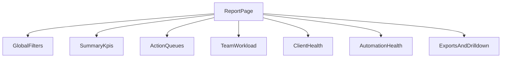

# 📄 Document F: Report Page Design
# Report 页面设计文档

**项目**: Smart Accounting  
**版本**: v1.0  
**日期**: 2026-04-10  
**状态**: ✅ 设计分析已落地（当前实现仍为占位页）

---

## 1. 文档目的

这份文档用于回答两个问题：

1. 当前 `report` 页面在代码里到底是什么状态？
2. 对会计事务所来说，`report` 页面第一版最值得做成什么样？

本文件不等同于法定财务报表说明书。当前 `report` 更适合定义为：

- 面向事务所内部运营的聚合视图
- 连接 Board、Clients、Status Projects、Automation Logs 的管理页
- 提供“发现问题 -> 立即跳转处理”的报表入口

---

## 2. 当前实现现状

### 2.1 当前路由与挂载

`report` 已经是正式产品视图的一部分，但目前仍是占位实现。

代码落点：

- `smart_accounting/public/js/smart_board/utils/viewTypes.js`
  - `report` 已被列入产品视图常量
- `smart_accounting/public/js/smart_board/components/Layout/Sidebar.js`
  - 侧边栏已提供 `report` 导航入口
- `smart_accounting/public/js/smart_board/app.js`
  - 允许 `view=report` 路由进入该页面
- `smart_accounting/public/js/smart_board/components/Layout/MainContent.js`
  - 已注册 `ReportApp` 并负责挂载 / 销毁
- `smart_accounting/public/js/smart_board/components/ReportView/ReportApp.js`
  - 当前占位页的实际实现

### 2.2 当前页面实际显示什么

当前 `ReportApp` 只渲染三个 tab：

- `Daily`
- `Weekly`
- `Monthly`

每个 tab 当前都只显示一条占位文案：

- `Report data for <tab> is coming soon.`

### 2.3 当前没有的东西

- 没有专用后端 Report API
- 没有真实 KPI
- 没有按日期范围的聚合查询
- 没有 drill-down 到具体问题列表的业务内容
- 没有报表级筛选器

### 2.4 当前已具备的基础

- 导航、URL、页面挂载、样式骨架都已具备
- `report` 已可与其它产品视图共存于同一产品壳
- 后续只需要补数据层和页面结构，不需要重新接路由

---

## 3. 当前可复用的数据基础

虽然 `report` 还没有专用 API，但现有系统已经有不少可复用能力。

### 3.1 项目与工作项数据

优先可复用：

- `smart_accounting/api/project_board.py`
  - 项目列表
  - Dashboard “我的项目”
  - 状态相关聚合
  - task count / hydration / 查询辅助

可复用方向：

- 活跃项目数
- 状态分布
- 临近截止 / 逾期项目
- 需要 review 的项目
- 长时间未更新的项目

### 3.2 客户维度数据

- `smart_accounting/api/clients.py`

可复用方向：

- 客户活跃项目数量
- 归档 / 活跃客户分布
- 重点客户异常列表

### 3.3 活动与审计数据

- `smart_accounting/api/activity_log.py`

可复用方向：

- 最近有无更新
- 哪些项目长时间无动作
- 团队近期操作密度

### 3.4 自动化与异常数据

- `smart_accounting/api/automation_logs.py`
- `smart_accounting/api/automation.py`

可复用方向：

- 自动化失败次数
- 最近失败记录
- 哪些规则最常触发问题

### 3.5 导出能力

- 前端 CSV 导出：`smart_accounting/public/js/smart_board/utils/csvExport.js`

可复用方向：

- 导出当前报表结果
- 导出某个区块的当前筛选数据

---

## 4. 会计事务所场景下，Report 页面真正要解决什么问题

对事务所来说，最重要的通常不是“看一张漂亮图表”，而是尽快回答以下问题：

- 现在全所还有多少活跃项目？
- 哪些项目已经逾期，哪些项目本周快到期？
- 哪些项目卡在 review / partner review？
- 哪些客户有异常，需要优先关注？
- 团队里谁负载过重，谁的工作被卡住？
- 自动化有没有失败，失败后有没有人跟进？

所以 `report` 页面更适合做成：

- 运营报表页
- 风险暴露页
- 工作分配与交付管理页

而不是：

- 通用 BI 画廊
- ERP 财务总账报表替代品
- 一开始就承诺复杂 OLAP 的分析中心

---

## 5. 推荐页面定位

### 5.1 页面定义

`Report` 应定义为：

> 面向事务所管理者、经理、合伙人的“跨 board 聚合视图”，用来快速识别风险、负载和跟进重点。

### 5.2 主要用户

#### Preparer / 执行人员

最关心：

- 我的到期项目
- 我的逾期项目
- 我的待 review 项目

#### Manager / Reviewer

最关心：

- 团队总工作量
- 哪些项目在等待 review
- 哪些项目长时间没有推进

#### Partner / Owner

最关心：

- 全所总体交付情况
- 风险客户 / 风险项目
- 自动化失败与流程堵点

---

## 6. 推荐信息架构

建议不要把 `Daily / Weekly / Monthly` 直接做成三套完全不同页面。

更推荐：

- 顶部统一使用一个时间范围切换器
- 提供预设：
  - Today
  - This Week
  - This Month

如果为了兼容当前 UI 结构保留 tab，也应让它们只代表时间预设，而不是三套完全不同数据模型。

### 6.1 页面结构建议

### 6.2 区块建议

#### A. Global Filters

建议至少有：

- 时间范围
- Project Type
- Company / Module
- Team member / role
- Status

#### B. Summary KPIs

第一排 KPI 卡建议：

- Active Projects
- Overdue
- Due This Week
- Waiting Review
- Completed This Period
- Automation Failures

#### C. Action Queues

这是首版最有价值的区块。

建议包含：

- 已逾期项目
- 本周到期项目
- Waiting for Review / Partner Review
- 长时间未更新项目

每个列表都应支持：

- 点击项目名直接跳回对应 board
- 点击状态跳到 `status-projects`
- 点击客户跳到 `client-projects`

#### D. Team Workload

建议展示：

- 每人当前活跃项目数
- 每人逾期项目数
- 每人待 review 项目数

这比单纯饼图更有操作价值。

#### E. Client Health

建议展示：

- 当前活跃项目最多的客户
- 逾期项目较多的客户
- 长期无更新但仍活跃的客户

#### F. Automation Health

建议展示：

- 最近自动化失败
- 最近失败最多的规则
- 失败后尚未处理的对象

---

## 7. 首版范围建议

### 7.1 首版应该做什么

首版建议只做：

- 只读报表
- 可筛选
- 可跳转
- 可导出

建议第一版只覆盖：

1. 概览 KPI
2. 已逾期 / 临近到期 / Waiting Review 三个工作队列
3. Team Workload 简表
4. 最近自动化失败列表
5. CSV 导出当前结果

### 7.2 首版不建议做什么

首版不建议：

- 自定义拖拽图表布局
- 复杂多维透视分析
- 图表比列表多
- 直接对接法定财务报表
- 为报表单独设计一套全新数据模型

---

## 8. 后端实现建议

### 8.1 不建议继续把 Report 逻辑塞进 `project_board.py`

原因：

- `project_board.py` 已经承担太多职责
- 报表天然是聚合查询，不应继续扩大 God module

### 8.2 建议新建独立报表 API

建议路径之一：

- `smart_accounting/api/reporting.py`

建议方法：

- `get_report_summary`
- `get_due_risk_report`
- `get_team_workload_report`
- `get_client_health_report`
- `get_automation_health_report`

这样可以：

- 保持 report 逻辑内聚
- 避免继续污染 board 查询模块
- 让后续页面迭代更清晰

---

## 9. 前端实现建议

### 9.1 当前 `ReportApp` 的最小演进路径

建议顺序：

1. 保留当前 `ReportApp` 组件位置
2. 把 tab 改造成时间范围预设
3. 补顶部筛选器
4. 先上 KPI + 列表，不急着上图表
5. 每个列表项都支持 drill-down

### 9.2 Drill-down 原则

报表不是终点页，应该是分流页。

建议跳转目标：

- 项目名 -> 对应 board / project drawer
- 客户 -> `client-projects`
- 状态 -> `status-projects`
- 自动化失败对象 -> `automation-logs`

---

## 10. 推荐开发阶段

### Phase 1

- Summary KPIs
- Overdue / Due This Week / Waiting Review
- 时间范围切换

### Phase 2

- Team Workload
- Client Health
- Automation Health

### Phase 3

- CSV 导出增强
- 更细筛选器
- 更强 drill-down

---

## 11. 设计结论

当前 `report` 页面不是“没有方向”，而是“壳已经就位，业务内容还没开始做”。

对于会计事务所，最合理的设计不是先追求复杂图表，而是优先做：

- 逾期与临期风险
- review 堵点
- 团队负载
- 客户异常
- 自动化失败

也就是说，`report` 的第一目标应是帮助团队每天决定：

- 先处理什么
- 谁需要介入
- 哪些客户或项目已经有风险

而不是先做成一个“看起来像 BI”的页面。
